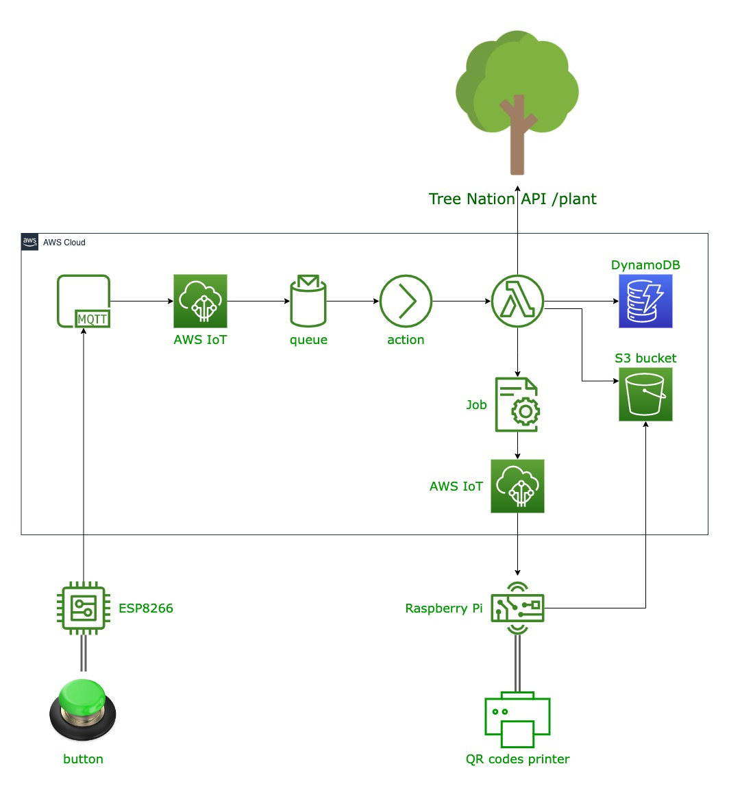

# AWS IoT Tree Button

This repository contains the source code for the IoT solution described in my blog post ["Push the Green Button: Creating Event Gadgets with IoT and Serverless Architecture"](https://letsmake.cloud/push-the-green-button-creating-event-gadgets-with-iot-and-serverless-architecture). The solution utilizes an IoT button, AWS Lambda, and an IoT-connected printer to create an interactive and sustainable giveaway for events.

## Architecture

## How to Use

To use the code in this repository, you should follow these steps:

1. Clone the repository to your local machine.
2. Replace the variables in `config.yaml` with your own values.
3. Use it as a normal AWS CDK project (refer to the [AWS CDK documentation](https://docs.aws.amazon.com/cdk/latest/guide/home.html) for more information).

Please refer to the [blog post](https://letsmake.cloud/push-the-green-button-creating-event-gadgets-with-iot-and-serverless-architecture) for a detailed walkthrough of the entire process.
